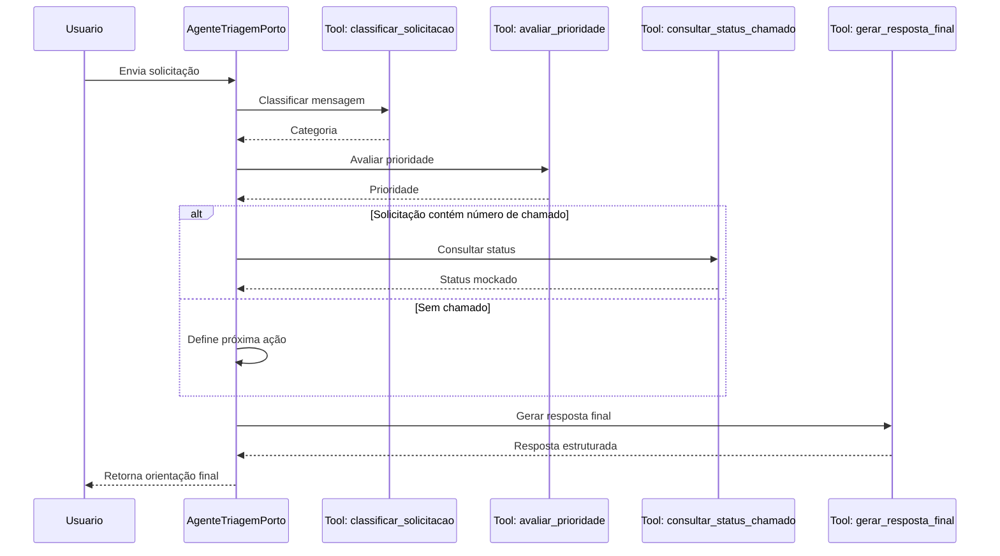

# Exercício Prático — Criando um Miniagente de Triagem de Solicitações Internas

## Tema

Criar um **miniagente com tool-use** capaz de receber uma solicitação interna, classificar o tipo do problema, escolher a ferramenta correta e gerar uma resposta estruturada para o usuário.

---

## Objetivo do Exercício

Ao final da atividade, o aluno será capaz de:

* Identificar quando um agente precisa usar ferramentas.
* Criar um fluxo simples de decisão agentic.
* Implementar um miniagente em Python com múltiplas ferramentas.
* Aplicar critérios mínimos de qualidade, rastreabilidade e segurança.
* Explicar a arquitetura do agente criado.

---

## Contexto do Problema

A Porto recebe diariamente solicitações internas de diferentes áreas, como:

* dúvidas sobre sistemas;
* pedidos de automação;
* incidentes operacionais;
* consultas sobre status de processos;
* pedidos de priorização.

Hoje, muitas dessas solicitações chegam de forma desorganizada. O objetivo é criar um miniagente que ajude a fazer uma **primeira triagem automática**.

---

## Desafio

Construir um miniagente chamado:

```text
AgenteTriagemPorto
```

Esse agente deverá receber uma mensagem em linguagem natural e decidir qual ferramenta usar.

Exemplos de entrada:

```text
"Preciso saber se o sistema de apólices está instável."
```

```text
"Gostaria de automatizar o envio de relatórios semanais para minha área."
```

```text
"Meu processo de reembolso está parado há 5 dias."
```

```text
"Quero consultar o status do chamado 12345."
```

---

## Ferramentas que o Agente Deve Ter

O agente deve implementar pelo menos **4 ferramentas**.

### 1. `classificar_solicitacao`

Classifica a solicitação em uma das categorias:

* `incidente`
* `automacao`
* `consulta_status`
* `duvida_geral`
* `fora_de_escopo`

---

### 2. `consultar_status_chamado`

Recebe um número de chamado e retorna um status mockado.

Exemplo:

```python
consultar_status_chamado("12345")
```

Resposta esperada:

```text
Chamado 12345 está em análise pelo time responsável.
```

---

### 3. `avaliar_prioridade`

Define a prioridade da solicitação:

* `baixa`
* `media`
* `alta`
* `critica`

Critérios sugeridos:

* Se mencionar “parado”, “erro”, “indisponível” ou “instável”, prioridade alta.
* Se mencionar impacto em cliente, prioridade crítica.
* Se for dúvida simples, prioridade baixa.
* Se for pedido de automação, prioridade média.

---

### 4. `gerar_resposta_final`

Gera uma resposta clara para o usuário contendo:

* categoria identificada;
* prioridade;
* próxima ação recomendada;
* ferramenta usada;
* justificativa da decisão.

---

## Requisitos Funcionais

O miniagente deve:

1. Receber uma mensagem do usuário.
2. Classificar a solicitação.
3. Identificar se precisa consultar uma ferramenta.
4. Executar a ferramenta adequada.
5. Gerar uma resposta final estruturada.
6. Registrar um trace simples da execução.

---

## Requisitos Técnicos

O código deve conter:

```text
- Uma classe ou função principal do agente.
- Um registry de ferramentas.
- Pelo menos 4 ferramentas.
- Um fluxo de decisão.
- Tratamento para solicitações fora de escopo.
- Trace da execução.
- Pelo menos 5 testes manuais com entradas diferentes.
```

---

## Arquitetura Esperada



---

## Atividade em Grupo

### Tempo estimado

**35 minutos**

### Dinâmica

Cada grupo deverá:

1. Escolher um nome para o miniagente.
2. Definir o problema interno que ele resolve.
3. Listar as ferramentas necessárias.
4. Desenhar o fluxo de decisão.
5. Implementar o agente em Python.
6. Testar com pelo menos 5 mensagens.
7. Apresentar o resultado em até 3 minutos.

---

## Casos de Teste Obrigatórios

O agente deve funcionar com as seguintes entradas:

### Caso 1

```text
"O sistema de apólices está instável desde cedo."
```

Resultado esperado:

```text
Categoria: incidente
Prioridade: alta
Ação recomendada: abrir ou escalar chamado técnico
```

---

### Caso 2

```text
"Quero automatizar o envio de relatório semanal para minha liderança."
```

Resultado esperado:

```text
Categoria: automacao
Prioridade: media
Ação recomendada: levantar processo atual e requisitos da automação
```

---

### Caso 3

```text
"Pode consultar o status do chamado 12345?"
```

Resultado esperado:

```text
Categoria: consulta_status
Prioridade: baixa ou media
Ação recomendada: retornar status do chamado
```

---

### Caso 4

```text
"Meu processo de reembolso está parado há 5 dias."
```

Resultado esperado:

```text
Categoria: incidente
Prioridade: alta
Ação recomendada: investigar bloqueio no fluxo
```

---

### Caso 5

```text
"Qual é a previsão do tempo para amanhã?"
```

Resultado esperado:

```text
Categoria: fora_de_escopo
Prioridade: baixa
Ação recomendada: informar que o agente trata apenas solicitações internas da Porto
```

---

## Entregáveis

Cada grupo deve entregar:

1. Código Python do miniagente.
2. Lista de ferramentas implementadas.
3. Fluxo Mermaid ou desenho da arquitetura.
4. Resultado dos 5 testes.
5. Breve explicação das decisões do agente.

---

## Critérios de Avaliação

| Critério                                     | Peso |
| -------------------------------------------- | ---: |
| O agente usa ferramentas corretamente        |  25% |
| A classificação das solicitações faz sentido |  20% |
| O fluxo agentic está claro                   |  20% |
| O código está organizado e funcional         |  20% |
| A resposta final é útil para o usuário       |  15% |

---

## Desafio Extra

Adicionar uma ferramenta chamada:

```python
sugerir_proximo_passo(categoria, prioridade)
```

Ela deve recomendar ações diferentes conforme a categoria e a prioridade.

Exemplo:

```text
Se categoria = incidente e prioridade = critica:
"Acionar imediatamente o time responsável e registrar impacto ao cliente."
```

```text
Se categoria = automacao e prioridade = media:
"Mapear processo atual, identificar entradas e saídas, e estimar ganho operacional."
```
