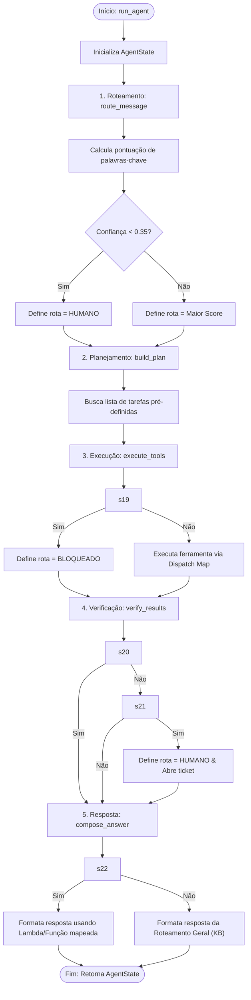
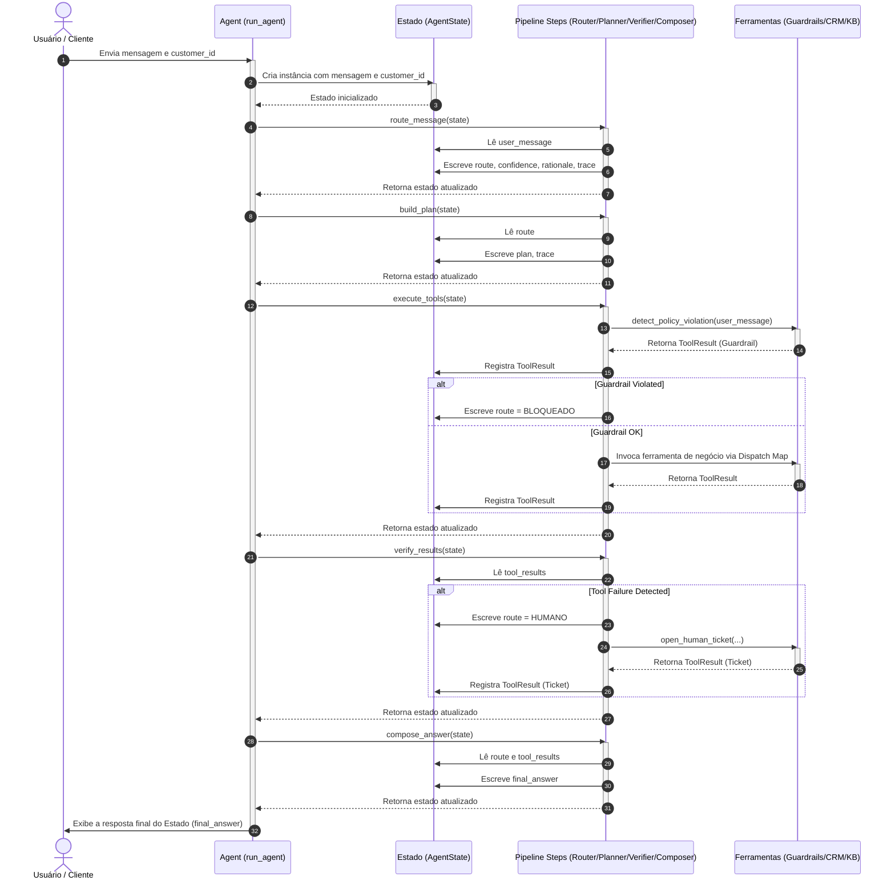

# Aula 3 — Arquitetura de Agentes: Multi-step Reasoning e Roteamento

Este projeto apresenta uma implementação didática e sem dependências externas de uma **Arquitetura de Agente Baseada em Estado (State-based Agent)**. O sistema utiliza uma esteira linear (pipeline) de etapas funcionais para ler, transformar e responder a solicitações de clientes de forma segura e transparente.

---

## 📌 Fluxo Geral do Código (Flowchart)

O fluxograma abaixo detalha como o estado da conversa (`AgentState`) trafega sequencialmente por cada etapa do pipeline, desde o recebimento da mensagem do usuário até a formatação da resposta em linguagem natural.

---

## 🔄 Diagrama de Sequência

Este diagrama ilustra a interação temporal e a troca de dados entre o Orquestrador do Agente, o objeto de Estado compartilhado, as etapas de execução e as APIs/Ferramentas externas mockadas.

---

## 🛠️ Padrões de Projeto Utilizados

A arquitetura deste agente foi estruturada seguindo práticas sólidas de engenharia de software para garantir que o código seja limpo, modular e fácil de manter:

1. **State-Based Agent (Padrão de Estado)**: Todas as decisões e históricos de execuções são mantidos na classe de dados `AgentState`. Isso garante rastreabilidade total (`trace`) e evita que as funções do pipeline gerem efeitos colaterais incontroláveis.
2. **Linear Pipeline / Pipe & Filter**: A orquestração do ciclo de vida é composta por uma lista sequencial de chamadas (`STEPS`), o que simplifica o fluxo de execução e a escrita de testes unitários determinísticos.
3. **Dispatch Map (Tabela de Roteamento/Despacho)**: Em vez de cadeias aninhadas de `if/elif/else` na execução de ferramentas e formatação de respostas, o código utiliza dicionários associando instâncias de rotas a comportamentos específicos (lambdas e funções locais). Isso torna a expansão do agente extremamente modular.
4. **Input Guardrail Pattern**: Interceptação e sanitização de solicitações na primeira barreira física antes de rodar qualquer código crítico de CRM, garantindo robustez de segurança.
