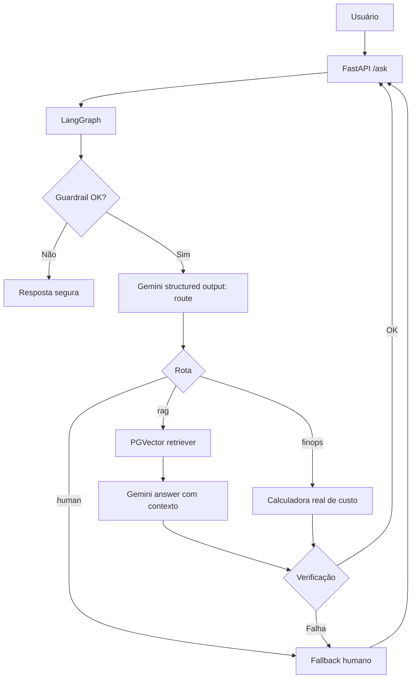

# Aula 6 — Hands-on real: Agente Gemini + RAG + LangGraph + PGVector

Projeto simples para laboratório guiado: um agente corporativo de suporte técnico para AI Experts Porto com implementação real de LLM Gemini, embeddings Gemini, RAG em banco vetorial PostgreSQL/pgvector, orquestração com LangGraph, API FastAPI e testes unitários com mocks/fakes apenas no contexto de teste.

## O que este projeto entrega

- LLM real via `ChatGoogleGenerativeAI`.
- Embeddings reais via `GoogleGenerativeAIEmbeddings`.
- Banco vetorial real com PostgreSQL + extensão `pgvector`, usando `langchain-postgres`.
- RAG completo: ingestão, chunking, embeddings, indexação, retrieval, geração com contexto e fontes.
- Grafo LangGraph com guardrail, roteamento estruturado, retrieval, resposta, verificação e fallback humano.
- API FastAPI para `/health`, `/ingest` e `/ask`.
- Docker Compose para subir API + banco vetorial.
- Testes unitários sem chamada externa; mocks/fakes ficam apenas nos testes.

## Arquitetura



## Pré-requisitos

- Docker e Docker Compose.
- Chave da Gemini API.
- Python 3.11+ apenas se rodar local sem Docker.

## Setup rápido com Docker

```bash
cd aula06_porto_real_agent_rag_gemini
cp .env.example .env
# edite .env e informe GOOGLE_API_KEY ou GEMINI_API_KEY

docker compose up --build
```

A API sobe em `http://localhost:8000`.

## Ingestão inicial da base de conhecimento

Em outro terminal:

```bash
curl -X POST http://localhost:8000/ingest \
  -H 'Content-Type: application/json' \
  -d '{"load_seed": true}'
```

## Consulta RAG

```bash
curl -X POST http://localhost:8000/ask \
  -H 'Content-Type: application/json' \
  -d '{"question":"Como desenhar guardrails para um agente com tool-use?","customer_id":"LAB-001"}'
```

## Consulta FinOps

```bash
curl -X POST http://localhost:8000/ask \
  -H 'Content-Type: application/json' \
  -d '{"question":"Estime o custo para 50000 chamadas por mês com 900 tokens de entrada e 300 de saída."}'
```

## Executar testes

```bash
python -m pytest -q
```

Os testes unitários não chamam Gemini nem PostgreSQL. As dependências externas são exercitadas no runtime do serviço Docker e em testes de integração opcionais.

## Variáveis principais

| Variável | Uso |
|---|---|
| `GOOGLE_API_KEY` ou `GEMINI_API_KEY` | Autenticação Gemini Developer API |
| `GEMINI_CHAT_MODEL` | Modelo de chat. Default: `gemini-3.5-flash` |
| `GEMINI_EMBEDDING_MODEL` | Modelo de embedding. Default: `gemini-embedding-2` |
| `EMBEDDING_DIMENSIONS` | Dimensão dos vetores. Default: `768` |
| `DATABASE_URL` | Conexão PostgreSQL/pgvector |
| `VECTOR_COLLECTION_NAME` | Coleção no PGVector |
| `RAG_TOP_K` | Quantidade de chunks recuperados |

## Comandos úteis

```bash
# subir tudo
docker compose up --build

# ver logs da API
docker compose logs -f api

# recriar banco vetorial do zero
docker compose down -v

docker compose up --build
```
