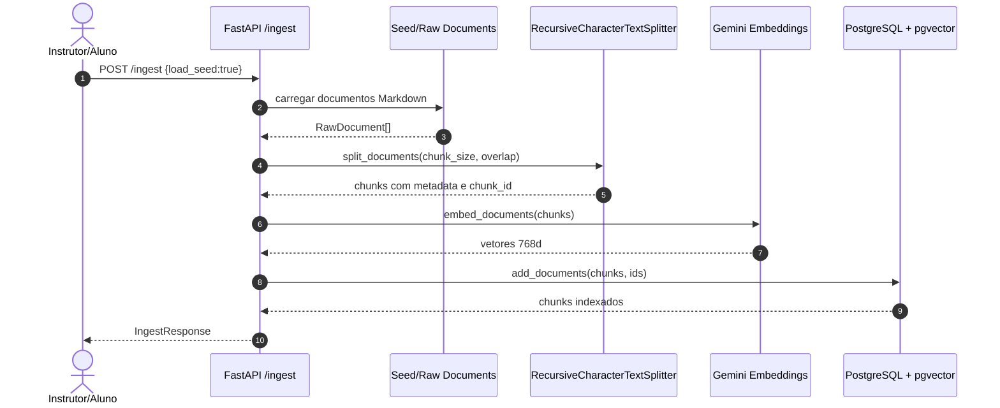
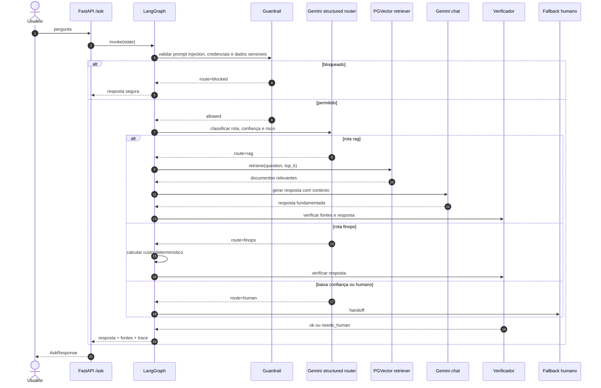
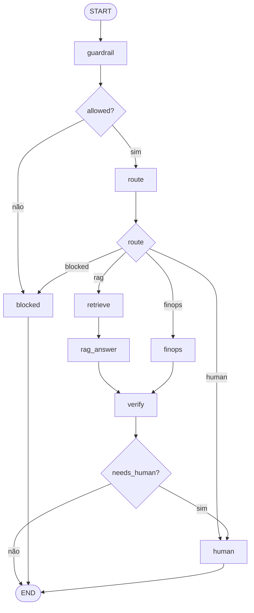

# Diagramas Mermaid — Aula 6 código real

## Sequência: ingestão RAG

```mermaid
sequenceDiagram
    autonumber
    actor Instrutor as Instrutor/Aluno
    participant API as FastAPI /ingest
    participant Loader as Seed/Raw Documents
    participant Splitter as RecursiveCharacterTextSplitter
    participant Emb as Gemini Embeddings
    participant DB as PostgreSQL + pgvector

    Instrutor->>API: POST /ingest {load_seed:true}
    API->>Loader: carregar documentos Markdown
    Loader-->>API: RawDocument[]
    API->>Splitter: split_documents(chunk_size, overlap)
    Splitter-->>API: chunks com metadata e chunk_id
    API->>Emb: embed_documents(chunks)
    Emb-->>API: vetores 768d
    API->>DB: add_documents(chunks, ids)
    DB-->>API: chunks indexados
    API-->>Instrutor: IngestResponse
```

## Sequência: consulta com LangGraph

```mermaid
sequenceDiagram
    autonumber
    actor Usuario as Usuário
    participant API as FastAPI /ask
    participant Graph as LangGraph
    participant Guard as Guardrail
    participant Router as Gemini structured router
    participant PG as PGVector retriever
    participant LLM as Gemini chat
    participant Verify as Verificador
    participant Human as Fallback humano

    Usuario->>API: pergunta
    API->>Graph: invoke(state)
    Graph->>Guard: validar prompt injection, credenciais e dados sensíveis
    alt bloqueado
        Guard-->>Graph: route=blocked
        Graph-->>API: resposta segura
    else permitido
        Guard-->>Graph: allowed
        Graph->>Router: classificar rota, confiança e risco
        alt rota rag
            Router-->>Graph: route=rag
            Graph->>PG: retrieve(question, top_k)
            PG-->>Graph: documentos relevantes
            Graph->>LLM: gerar resposta com contexto
            LLM-->>Graph: resposta fundamentada
            Graph->>Verify: verificar fontes e resposta
        else rota finops
            Router-->>Graph: route=finops
            Graph->>Graph: calcular custo determinístico
            Graph->>Verify: verificar resposta
        else baixa confiança ou humano
            Router-->>Graph: route=human
            Graph->>Human: handoff
        end
        Verify-->>Graph: ok ou needs_human
        Graph-->>API: resposta + fontes + trace
    end
    API-->>Usuario: AskResponse
```

## Grafo operacional

```mermaid
flowchart TD
    START([START]) --> G[guardrail]
    G --> C{allowed?}
    C -- não --> B[blocked]
    C -- sim --> R[route]
    R --> D{route}
    D -- rag --> RET[retrieve]
    RET --> A[rag_answer]
    A --> V[verify]
    D -- finops --> F[finops]
    F --> V
    D -- human --> H[human]
    D -- blocked --> B
    V --> VH{needs_human?}
    VH -- sim --> H
    VH -- não --> END([END])
    B --> END
    H --> END
```
