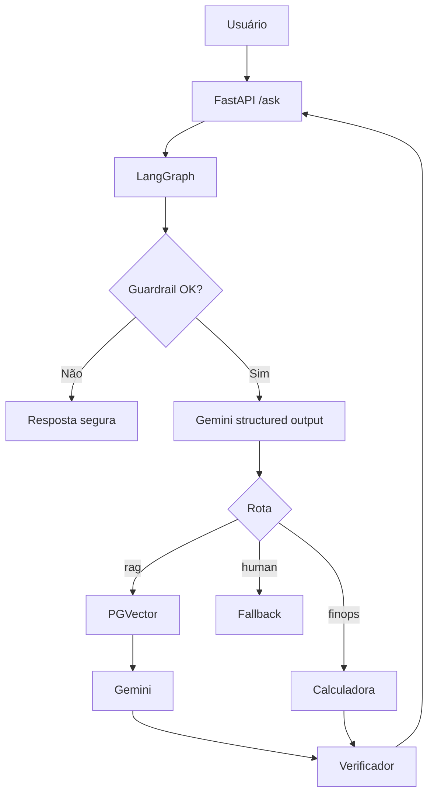

# Aula 6 — Código real com Gemini, RAG, LangGraph e PGVector

## Resultado entregue

Projeto hands-on com implementação real, sem mocks no runtime:

- LLM: `ChatGoogleGenerativeAI`.
- Embeddings: `GoogleGenerativeAIEmbeddings`.
- Vector DB: PostgreSQL com extensão `pgvector`.
- Vector store: `langchain-postgres` / `PGVector`.
- Orquestração: `LangGraph StateGraph`.
- API: FastAPI.
- Testes: mocks/fakes apenas em testes unitários.

## Como executar

```bash
cp .env.example .env
# configurar GOOGLE_API_KEY ou GEMINI_API_KEY
docker compose up --build
```

## Ingestão

```bash
curl -X POST http://localhost:8000/ingest \
  -H 'Content-Type: application/json' \
  -d '{"load_seed": true}'
```

## Consulta

```bash
curl -X POST http://localhost:8000/ask \
  -H 'Content-Type: application/json' \
  -d '{"question":"Como funciona RAG com banco vetorial?"}'
```

## Arquivos principais

| Arquivo | Função |
|---|---|
| `app/main.py` | API FastAPI |
| `app/graph.py` | Grafo LangGraph: guardrail, router, retrieval, resposta, verificação e fallback |
| `app/providers.py` | Factories reais para Gemini, embeddings e PGVector |
| `app/rag.py` | Load, split, index e retrieve |
| `app/embeddings.py` | Adapter de embeddings com prefixos de retrieval |
| `app/guardrails.py` | Bloqueios de segurança |
| `app/costing.py` | Cálculo FinOps determinístico |
| `docker-compose.yml` | API + PostgreSQL/pgvector |
| `data/knowledge_base` | Base de conhecimento para o RAG |
| `tests` | Testes unitários sem chamada externa |

## Diagramas



## Validação local

```text
python -m compileall app tests scripts
python -m pytest -q
11 passed, 1 skipped
```

## Exercícios

1. Adicionar novo documento à base RAG e reindexar.
2. Adicionar guardrail destrutivo para pedidos de apagar base ou dropar tabela.
3. Melhorar verificação exigindo seção `Fontes usadas`.
4. Criar nova tool LangChain baseada no trace.
5. Criar teste usando fake LLM apenas dentro do teste.
