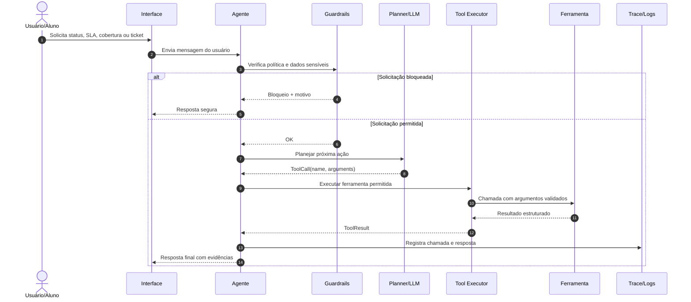
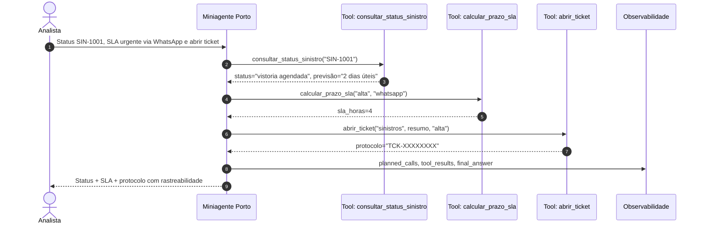
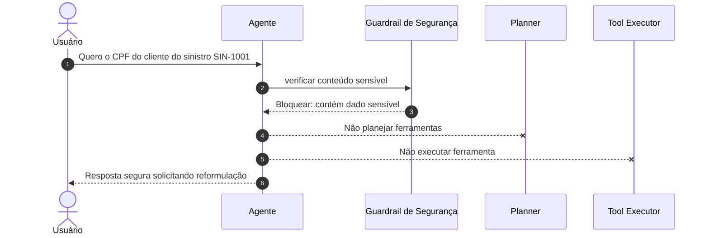

# Aula 2 — Arquitetura Agentic e Tool-Use

**Curso:** AI Experts Porto  
**Módulo:** Arquiteturas de Agentes e Padrões de Solução  
**Tema da aula:** Arquitetura agentic, tool-use, multi-step, guardrails, rastreabilidade e avaliação inicial  
**Duração:** 3h  
**Horário:** 16h às 19h  
**Formato recomendado:** Workshop ao vivo com demonstração guiada e prática em grupo  
**Público-alvo:** Desenvolvedores sêniores, arquitetos, tech leads, profissionais de dados/IA e AI Champions internos  

---

## 1. Objetivos de aprendizagem

Ao final da aula, o participante será capaz de:

1. **Explicar** a diferença entre chatbot, workflow determinístico e agente com tool-use.
2. **Desenhar** uma arquitetura agentic mínima com planner, executor de ferramentas, guardrails e trace.
3. **Implementar** um miniagente em Python com ferramentas mockadas, validação de argumentos e resposta rastreável.
4. **Avaliar** o comportamento do agente usando testes automatizados, critérios de aceite e análise de trace.
5. **Propor** ferramentas seguras para um problema interno da Porto, respeitando limites de dados, permissões e auditoria.

---

## 2. Cronograma rigoroso da aula

| Horário | Duração | Bloco | Resultado esperado |
|---|---:|---|---|
| 16:00–16:10 | 10 min | Abertura e conexão com problemas reais | Alunos entendem por que tool-use muda o tipo de solução possível |
| 16:10–16:30 | 20 min | Teoria intuitiva: arquitetura agentic | Alunos conseguem nomear os componentes de um agente |
| 16:30–16:50 | 20 min | Tool-use: contrato, schema, executor e allowlist | Alunos entendem como uma LLM aciona funções externas com segurança |
| 16:50–17:10 | 20 min | Diagramas de sequência e fluxo multi-step | Alunos visualizam o ciclo agente → ferramenta → observação → resposta |
| 17:10–17:20 | 10 min | Intervalo rápido | Pausa |
| 17:20–17:55 | 35 min | Demonstração prática em Python | Professor implementa e executa o miniagente |
| 17:55–18:30 | 35 min | Atividade guiada em grupos | Grupos estendem o agente ou desenham uma nova ferramenta |
| 18:30–18:50 | 20 min | Exercícios, avaliação e gabarito comentado | Alunos validam entendimento técnico |
| 18:50–19:00 | 10 min | Fechamento e próximos passos | Alunos saem com tarefa aplicada e critérios de aceite |

---

## 3. Aula manuscrita — roteiro do professor

### 16:00–16:10 — Abertura

**Fala sugerida:**

> Na aula anterior, começamos a sair do uso genérico de IA e entramos em uma pergunta mais importante: como transformar IA em solução corporativa confiável? Hoje vamos dar o próximo passo. Um chatbot responde. Um agente decide quando precisa agir. E quando ele age, ele não deve agir de qualquer forma: precisa usar ferramentas permitidas, com argumentos válidos, limites claros, rastreabilidade e critérios de qualidade.

**Pergunta de ativação:**

> Pense em uma tarefa interna repetitiva da Porto: consultar status, abrir chamado, calcular prazo, validar uma regra ou buscar informação em um sistema. Onde uma IA apenas conversando não resolve? Em que momento ela precisaria usar uma ferramenta?

**Objetivo da abertura:**

Conectar o conteúdo técnico à experiência real dos alunos adultos. O foco não é “fazer um agente bonito”, mas resolver problemas internos com segurança, qualidade e rastreabilidade.

**Mensagem-chave:**

> Tool-use é o ponto em que uma IA deixa de ser apenas uma interface conversacional e passa a ser parte de uma arquitetura de software.

---

### 16:10–16:30 — Teoria intuitiva: o que é arquitetura agentic

**Fala sugerida:**

> Uma arquitetura agentic é uma arquitetura onde um modelo de linguagem participa de um ciclo de decisão. Ele recebe uma intenção, interpreta o contexto, decide se precisa ou não chamar ferramentas, recebe os resultados dessas ferramentas e produz uma resposta ou próxima ação.

**Modelo mental:**

```text
Usuário → Agente → Planejador → Ferramentas → Observação → Resposta
                 ↘ Guardrails ↙
                 ↘ Trace/Avaliação ↙
```

**Componentes essenciais:**

| Componente | Papel | Exemplo na aula |
|---|---|---|
| Instruções | Definem comportamento, limites e tom | “Você é um assistente interno que só usa ferramentas permitidas” |
| Planner | Decide quais ferramentas chamar | Detecta status, SLA, cobertura ou ticket |
| Tool Registry | Catálogo de ferramentas disponíveis | `consultar_status_sinistro`, `calcular_prazo_sla` |
| Tool Executor | Executa ferramentas com validação | Bloqueia ferramenta fora da allowlist |
| Guardrails | Impõem limites de segurança | Bloqueia CPF, senha, cartão e dados pessoais |
| Trace | Registra o que aconteceu | Entrada, ferramentas chamadas, resultados e resposta final |
| Avaliação | Mede se o agente se comportou como esperado | Testes unitários e casos de aceite |

**Comparação didática:**

| Tipo de solução | Como decide? | Quando usar? | Limitação |
|---|---|---|---|
| Chatbot simples | Responde texto | FAQ, explicações, triagem simples | Não age sobre sistemas |
| Workflow fixo | Fluxo programado | Processo estável e previsível | Pouca flexibilidade |
| Agente com tool-use | Decide ferramenta por intenção e contexto | Problemas com múltiplos caminhos e ações | Exige governança, avaliação e rastreabilidade |

**Mensagem-chave:**

> Agente não é sinônimo de autonomia total. Em ambiente corporativo, bom agente é autonomia controlada.

---

### 16:30–16:50 — Tool-use: contrato, schema, executor e allowlist

**Fala sugerida:**

> Uma ferramenta de agente deve ser tratada como uma API interna. Ela precisa ter nome claro, descrição objetiva, parâmetros obrigatórios, validação, política de erro e limite de permissão. O modelo não deve executar qualquer coisa. Ele só pode pedir a execução de ferramentas que a aplicação disponibilizou.

**Exemplo conceitual de ferramenta:**

```json
{
  "name": "consultar_status_sinistro",
  "description": "Consulta o andamento de um sinistro pelo número SIN-0000.",
  "parameters": {
    "type": "object",
    "properties": {
      "numero_sinistro": {
        "type": "string",
        "description": "Número do sinistro no formato SIN-0000"
      }
    },
    "required": ["numero_sinistro"],
    "additionalProperties": false
  },
  "strict": true
}
```

**Explicação:**

- `name`: nome estável, claro e acionável.
- `description`: ajuda o modelo a decidir quando usar a ferramenta.
- `parameters`: contrato de entrada.
- `required`: campos obrigatórios.
- `additionalProperties: false`: reduz argumentos inesperados.
- `strict: true`: força aderência mais rígida ao schema quando suportado pela plataforma.

**Boa prática para nomear ferramentas:**

| Ruim | Melhor |
|---|---|
| `get_data` | `consultar_status_sinistro` |
| `do_action` | `abrir_ticket_atendimento` |
| `call_api` | `consultar_cobertura_produto` |
| `process` | `calcular_prazo_sla` |

**Mensagem-chave:**

> Uma ferramenta mal descrita gera agente confuso. Uma ferramenta sem validação gera risco operacional.

---

### 16:50–17:10 — Diagramas de sequência

#### Diagrama 1 — Ciclo geral de tool-use



#### Diagrama 2 — Fluxo multi-step: status de sinistro + SLA + ticket



#### Diagrama 3 — Guardrail bloqueando dado sensível



**Fala sugerida:**

> Observem que o agente não executa ferramenta antes do guardrail. Também não chama uma função diretamente pelo desejo do usuário. Primeiro existe uma etapa de decisão. Depois existe uma etapa de execução validada. E tudo precisa ser registrado.

---

### 17:20–17:55 — Demonstração prática em Python

**Objetivo da demonstração:**

Construir um miniagente corporativo didático que roda 100% local, sem chave de API, simulando o comportamento de um agente com tool-use.

**Cenário:**

Um analista interno deseja perguntar ao agente:

> “Qual o status do sinistro SIN-1001? Calcule o SLA urgente via WhatsApp e abrir ticket.”

O agente deve:

1. Detectar que existe um sinistro.
2. Consultar o status do sinistro.
3. Calcular o SLA.
4. Abrir um ticket.
5. Responder com evidências.
6. Registrar trace.

**Comandos para executar:**

```bash
cd aula02_agentic_tooluse
python -m unittest discover -s tests -v
python src/mini_agent_porto.py
```

**Pontos de atenção durante a demonstração:**

- O planner usado na aula é determinístico para facilitar o aprendizado.
- Em produção, essa decisão normalmente seria feita por um modelo com function calling/tool calling.
- O executor usa allowlist.
- As ferramentas são mockadas para evitar dependência de sistemas reais.
- O trace permite auditoria e avaliação.

---

## 4. Material de apoio

### 4.1 Checklist para desenhar uma ferramenta de agente

Antes de disponibilizar uma ferramenta para um agente, responda:

| Pergunta | Por que importa? |
|---|---|
| Qual problema real essa ferramenta resolve? | Evita ferramenta genérica demais |
| Qual é o nome estável da ferramenta? | Facilita decisão do modelo |
| Quando ela deve ser chamada? | Melhora precisão do tool-use |
| Quais argumentos são obrigatórios? | Evita chamadas incompletas |
| Quais argumentos são proibidos? | Reduz risco de abuso |
| O schema impede propriedades extras? | Reduz superfície de erro |
| A ferramenta lê, escreve ou dispara ação? | Define risco operacional |
| A ação é idempotente? | Evita efeitos duplicados |
| Existe timeout? | Evita travamento do fluxo |
| Existe log/trace? | Permite auditoria |
| Existe política de erro? | Permite resposta segura |
| A ferramenta acessa dados sensíveis? | Exige guardrails e autorização |

### 4.2 Template de especificação de ferramenta

```markdown
## Ferramenta: nome_da_ferramenta

**Objetivo:**

**Quando usar:**

**Quando não usar:**

**Entrada:**
- campo_1: tipo, obrigatório/opcional, descrição
- campo_2: tipo, obrigatório/opcional, descrição

**Saída esperada:**

**Erros possíveis:**

**Permissões necessárias:**

**Dados sensíveis envolvidos:**

**Critérios de aceite:**

**Logs/trace obrigatórios:**
```

### 4.3 Critérios mínimos de qualidade para agentes com tool-use

| Categoria | Critério mínimo |
|---|---|
| Segurança | Não expor dado sensível; respeitar allowlist |
| Correção | Chamar ferramenta correta para a intenção correta |
| Robustez | Tratar ferramenta inexistente, argumento inválido e dado não encontrado |
| Observabilidade | Registrar entrada, chamadas planejadas, resultados e resposta |
| Avaliação | Ter casos positivos, negativos e bloqueios testados |
| Custo | Evitar chamadas desnecessárias |
| Experiência | Responder com clareza e evidência, não apenas “feito” |

### 4.4 Rubrica de avaliação da atividade prática

| Critério | 0 ponto | 1 ponto | 2 pontos |
|---|---|---|---|
| Definição do problema | Genérica | Parcialmente contextualizada | Clara e ligada a dor real |
| Ferramentas | Sem contrato | Contrato parcial | Nome, descrição, argumentos e erros claros |
| Fluxo multi-step | Não existe | Linear simples | Tem decisão, ferramenta, observação e resposta |
| Guardrails | Ausentes | Genéricos | Específicos para risco do domínio |
| Trace | Ausente | Parcial | Entrada, calls, results e resposta registrados |
| Testes | Ausentes | Testes felizes | Testes felizes, negativos e bloqueios |

---

## 5. Atividade guiada em grupo — PBL

### Problema

A área de atendimento precisa reduzir retrabalho em consultas repetitivas sobre sinistros, coberturas, SLA e abertura de chamados internos. Hoje, parte do esforço está em acessar sistemas diferentes, copiar dados, validar regra simples e registrar a conclusão manualmente.

### Missão do grupo

Desenhar e/ou estender um miniagente para resolver uma parte desse problema.

### Entregáveis do grupo

1. Nome do agente.
2. Problema específico que ele resolve.
3. Ferramentas necessárias.
4. Fluxo multi-step em Mermaid.
5. Guardrails mínimos.
6. Critérios de aceite.
7. Pelo menos 3 casos de teste.

### Restrições

- Não usar dados pessoais reais.
- Não chamar APIs reais durante a aula.
- Toda ferramenta deve ter contrato claro.
- Toda decisão relevante deve aparecer no trace.

---

## 6. Exercícios

### Exercício 1 — Classificação arquitetural

Classifique os itens abaixo como **Instrução**, **Tool**, **Guardrail**, **Trace**, **Planner** ou **Critério de avaliação**.

1. “Não exponha CPF, senha ou cartão.”
2. `consultar_status_sinistro(numero_sinistro)`
3. Registro JSON com entrada, ferramentas chamadas e resposta final.
4. Decisão de chamar `calcular_prazo_sla` quando a mensagem menciona prazo.
5. “Dado SIN-1001, o agente deve consultar status e retornar a etapa atual.”
6. “Você é um assistente interno da Porto focado em atendimento operacional.”

#### Resposta esperada

1. Guardrail.
2. Tool.
3. Trace.
4. Planner.
5. Critério de avaliação.
6. Instrução.

---

### Exercício 2 — Desenho de ferramenta

Crie a especificação de uma ferramenta chamada `consultar_franquia` para retornar o valor de referência de franquia por produto.

#### Resposta esperada

```markdown
## Ferramenta: consultar_franquia

**Objetivo:** consultar valor de referência de franquia por produto de seguro.

**Quando usar:** quando o usuário perguntar sobre franquia de auto, residencial ou vida.

**Quando não usar:** quando o usuário pedir dados pessoais, apólice real ou informação contratual individualizada.

**Entrada:**
- tipo_seguro: string obrigatória. Valores aceitos: auto, residencial, vida.

**Saída esperada:**
- encontrado: boolean
- tipo_seguro: string
- valor_referencia: number
- observacao: string

**Erros possíveis:**
- Produto não encontrado.
- Argumento obrigatório ausente.

**Permissões necessárias:**
- Leitura de tabela pública/mockada de produtos.

**Dados sensíveis envolvidos:**
- Nenhum no exercício didático.

**Critérios de aceite:**
- Dado "auto", retorna R$ 1500.00.
- Dado produto inexistente, retorna encontrado=false.
- Não executa se a mensagem mencionar CPF ou outro dado sensível.
```

---

### Exercício 3 — Implementação

Adicione ao agente uma ferramenta de franquia e teste se o agente chama a ferramenta quando o usuário perguntar:

> “Qual a franquia do seguro auto?”

#### Resposta esperada

A implementação completa já está no arquivo `src/mini_agent_porto.py`. O teste correspondente está em `tests/test_mini_agent_porto.py`:

```python
def test_agente_usa_ferramenta_de_franquia(self):
    agent = build_agent()
    trace = agent.run("Qual a franquia do seguro auto?")
    self.assertFalse(trace.blocked)
    self.assertEqual(len(trace.planned_calls), 1)
    self.assertEqual(trace.planned_calls[0].name, "consultar_franquia")
    self.assertIn("Franquia de referência", trace.final_answer)
```

---

### Exercício 4 — PBL: miniagente para problema interno

Escolha um problema interno da Porto e desenhe um agente usando o template abaixo:

```markdown
# Nome do agente

## Problema

## Usuário-alvo

## Ferramentas

## Fluxo multi-step

## Guardrails

## Critérios de aceite

## Testes mínimos
```

#### Resposta modelo

```markdown
# Agente de Triagem de Sinistros

## Problema
Analistas gastam tempo consultando status, SLA e abertura de chamados para casos repetitivos de sinistro.

## Usuário-alvo
Analistas internos de atendimento e operação.

## Ferramentas
- consultar_status_sinistro(numero_sinistro)
- calcular_prazo_sla(criticidade, canal)
- abrir_ticket(area, resumo, prioridade)

## Fluxo multi-step
1. Receber solicitação.
2. Aplicar guardrail de dados sensíveis.
3. Identificar número de sinistro.
4. Consultar status.
5. Calcular SLA se houver menção a prazo, urgência ou canal.
6. Abrir ticket se solicitado.
7. Responder com resumo e evidências.
8. Registrar trace.

## Guardrails
- Bloquear CPF, senha, cartão e dados pessoais.
- Não abrir ticket sem resumo mínimo.
- Não permitir ferramentas fora da allowlist.
- Não consultar dados reais durante o exercício.

## Critérios de aceite
- SIN-1001 retorna status de vistoria agendada.
- Solicitação com CPF é bloqueada.
- Pedido com SLA urgente via WhatsApp retorna 4 horas úteis.
- Ticket criado retorna protocolo rastreável.

## Testes mínimos
- Caso feliz: status + SLA + ticket.
- Caso negativo: sinistro inexistente.
- Caso bloqueado: pedido com CPF.
```

---

## 7. Código Python completo e funcional

### 7.1 Arquivo `src/mini_agent_porto.py`

```python
"""
Miniagente corporativo didático para demonstrar Arquitetura Agentic e Tool-Use.

Objetivo pedagógico:
- Mostrar o loop perceber -> planejar -> chamar ferramenta -> observar -> responder.
- Demonstrar allowlist de ferramentas, validação de argumentos, rastreabilidade e guardrails.
- Rodar 100% local, sem chave de API e sem dependências externas.

Execução:
    python src/mini_agent_porto.py

Testes:
    python -m unittest discover -s tests -v
"""

from __future__ import annotations

from dataclasses import dataclass, field
from typing import Any, Callable
import json
import re
import uuid


# =========================
# 1. Contratos do agente
# =========================

@dataclass(frozen=True)
class ToolCall:
    """Pedido de execução de ferramenta feito pelo planejador."""

    name: str
    arguments: dict[str, Any]


@dataclass(frozen=True)
class ToolResult:
    """Resultado padronizado de uma ferramenta."""

    name: str
    ok: bool
    data: dict[str, Any]
    error: str | None = None


@dataclass(frozen=True)
class ToolDefinition:
    """Definição de uma ferramenta disponível para o agente."""

    name: str
    description: str
    required_args: tuple[str, ...]
    handler: Callable[..., dict[str, Any]]

    def validate(self, arguments: dict[str, Any]) -> None:
        missing = [arg for arg in self.required_args if arg not in arguments]
        if missing:
            raise ValueError(f"Argumentos obrigatórios ausentes para {self.name}: {', '.join(missing)}")

        extra = sorted(set(arguments) - set(self.required_args))
        if extra:
            raise ValueError(f"Argumentos não permitidos para {self.name}: {', '.join(extra)}")


@dataclass
class AgentTrace:
    """Trilha de execução para depuração, auditoria e avaliação."""

    user_input: str
    blocked: bool = False
    reason: str | None = None
    planned_calls: list[ToolCall] = field(default_factory=list)
    tool_results: list[ToolResult] = field(default_factory=list)
    final_answer: str | None = None

    def to_json(self) -> str:
        return json.dumps(
            {
                "user_input": self.user_input,
                "blocked": self.blocked,
                "reason": self.reason,
                "planned_calls": [call.__dict__ for call in self.planned_calls],
                "tool_results": [result.__dict__ for result in self.tool_results],
                "final_answer": self.final_answer,
            },
            ensure_ascii=False,
            indent=2,
        )


# =========================
# 2. Dados mockados
# =========================

SINISTROS = {
    "SIN-1001": {
        "produto": "auto",
        "status": "vistoria agendada",
        "etapa": "aguardando vistoria",
        "previsao": "2 dias úteis",
    },
    "SIN-2002": {
        "produto": "residencial",
        "status": "em análise técnica",
        "etapa": "validação de cobertura",
        "previsao": "3 dias úteis",
    },
}

COBERTURAS = {
    "auto": ["colisão", "roubo e furto", "guincho", "terceiros"],
    "residencial": ["incêndio", "danos elétricos", "vendaval", "assistência 24h"],
    "vida": ["morte natural", "morte acidental", "invalidez permanente"],
}

FRANQUIAS = {
    "auto": {"valor_referencia": 1500.00, "observacao": "Franquia padrão para colisão parcial."},
    "residencial": {"valor_referencia": 800.00, "observacao": "Franquia padrão para danos elétricos."},
    "vida": {"valor_referencia": 0.00, "observacao": "Produto sem franquia na base mockada."},
}

SLA_BASE_HORAS = {
    ("alta", "whatsapp"): 4,
    ("alta", "telefone"): 6,
    ("alta", "email"): 8,
    ("media", "whatsapp"): 12,
    ("media", "telefone"): 16,
    ("media", "email"): 24,
    ("baixa", "whatsapp"): 24,
    ("baixa", "telefone"): 36,
    ("baixa", "email"): 48,
}


# =========================
# 3. Ferramentas do domínio
# =========================

def consultar_status_sinistro(numero_sinistro: str) -> dict[str, Any]:
    """Consulta status de um sinistro em base mockada."""
    sinistro = SINISTROS.get(numero_sinistro.upper())
    if not sinistro:
        return {
            "encontrado": False,
            "numero_sinistro": numero_sinistro.upper(),
            "mensagem": "Sinistro não encontrado na base mockada.",
        }
    return {"encontrado": True, "numero_sinistro": numero_sinistro.upper(), **sinistro}


def consultar_cobertura_produto(tipo_seguro: str) -> dict[str, Any]:
    """Consulta coberturas disponíveis de um produto de seguro."""
    tipo = normalizar_texto(tipo_seguro)
    coberturas = COBERTURAS.get(tipo)
    if not coberturas:
        return {
            "encontrado": False,
            "tipo_seguro": tipo,
            "coberturas": [],
            "mensagem": "Produto não encontrado. Use auto, residencial ou vida.",
        }
    return {"encontrado": True, "tipo_seguro": tipo, "coberturas": coberturas}


def consultar_franquia(tipo_seguro: str) -> dict[str, Any]:
    """Consulta valor de referência de franquia por produto de seguro."""
    tipo = normalizar_texto(tipo_seguro)
    franquia = FRANQUIAS.get(tipo)
    if not franquia:
        return {
            "encontrado": False,
            "tipo_seguro": tipo,
            "mensagem": "Produto não encontrado. Use auto, residencial ou vida.",
        }
    return {"encontrado": True, "tipo_seguro": tipo, **franquia}


def calcular_prazo_sla(criticidade: str, canal: str) -> dict[str, Any]:
    """Calcula SLA inicial a partir de criticidade e canal."""
    criticidade_norm = normalizar_texto(criticidade)
    canal_norm = normalizar_texto(canal)
    horas = SLA_BASE_HORAS.get((criticidade_norm, canal_norm))
    if horas is None:
        return {
            "calculado": False,
            "mensagem": "Combinação não suportada. Criticidade: alta, media, baixa. Canal: whatsapp, telefone, email.",
        }
    return {
        "calculado": True,
        "criticidade": criticidade_norm,
        "canal": canal_norm,
        "sla_horas": horas,
        "sla_legivel": f"{horas} horas úteis",
    }


def abrir_ticket(area: str, resumo: str, prioridade: str) -> dict[str, Any]:
    """Abre ticket mockado e retorna protocolo rastreável."""
    area_norm = normalizar_texto(area)
    prioridade_norm = normalizar_texto(prioridade)
    protocolo = f"TCK-{uuid.uuid4().hex[:8].upper()}"
    return {
        "ticket_criado": True,
        "protocolo": protocolo,
        "area": area_norm,
        "prioridade": prioridade_norm,
        "resumo": resumo.strip(),
    }


# =========================
# 4. Guardrails e utilitários
# =========================

DANGEROUS_PATTERNS = [
    re.compile(r"\bcpf\b", re.IGNORECASE),
    re.compile(r"\bsenha\b", re.IGNORECASE),
    re.compile(r"\bcart[aã]o\b", re.IGNORECASE),
    re.compile(r"\bdados pessoais\b", re.IGNORECASE),
]


def normalizar_texto(texto: str) -> str:
    """Normaliza texto simples para matching determinístico."""
    return (
        texto.lower()
        .strip()
        .replace("é", "e")
        .replace("ê", "e")
        .replace("á", "a")
        .replace("à", "a")
        .replace("ã", "a")
        .replace("í", "i")
        .replace("ó", "o")
        .replace("ô", "o")
        .replace("ú", "u")
        .replace("ç", "c")
    )


def detectar_sinistro(texto: str) -> str | None:
    match = re.search(r"\bSIN-\d{4}\b", texto.upper())
    return match.group(0) if match else None


def detectar_tipo_seguro(texto: str) -> str | None:
    texto_norm = normalizar_texto(texto)
    for tipo in COBERTURAS:
        if tipo in texto_norm:
            return tipo
    return None


def detectar_canal(texto: str) -> str:
    texto_norm = normalizar_texto(texto)
    for canal in ["whatsapp", "telefone", "email"]:
        if canal in texto_norm:
            return canal
    return "email"


def detectar_prioridade(texto: str) -> str:
    texto_norm = normalizar_texto(texto)
    if any(p in texto_norm for p in ["urgente", "alta", "critico", "crítico"]):
        return "alta"
    if any(p in texto_norm for p in ["media", "média", "moderado"]):
        return "media"
    return "baixa"


def is_blocked_by_guardrail(user_input: str) -> str | None:
    for pattern in DANGEROUS_PATTERNS:
        if pattern.search(user_input):
            return "A solicitação parece envolver dado sensível. O agente não deve expor CPF, senha, cartão ou dados pessoais."
    return None


# =========================
# 5. Planejador determinístico
# =========================

class DeterministicPlanner:
    """
    Simula a etapa em que um LLM escolheria ferramentas.

    Em produção, esta decisão viria de um modelo com function calling.
    Aqui mantemos determinístico para aula, testes e execução sem API key.
    """

    def plan(self, user_input: str) -> list[ToolCall]:
        calls: list[ToolCall] = []
        texto_norm = normalizar_texto(user_input)

        numero_sinistro = detectar_sinistro(user_input)
        tipo_seguro = detectar_tipo_seguro(user_input)
        canal = detectar_canal(user_input)
        prioridade = detectar_prioridade(user_input)

        if numero_sinistro and any(p in texto_norm for p in ["status", "sinistro", "andamento"]):
            calls.append(ToolCall("consultar_status_sinistro", {"numero_sinistro": numero_sinistro}))

        if tipo_seguro and any(p in texto_norm for p in ["cobertura", "cobre", "produto"]):
            calls.append(ToolCall("consultar_cobertura_produto", {"tipo_seguro": tipo_seguro}))

        if tipo_seguro and "franquia" in texto_norm:
            calls.append(ToolCall("consultar_franquia", {"tipo_seguro": tipo_seguro}))

        if any(p in texto_norm for p in ["sla", "prazo", "tempo de resposta"]):
            calls.append(ToolCall("calcular_prazo_sla", {"criticidade": prioridade, "canal": canal}))

        if any(p in texto_norm for p in ["abrir ticket", "criar ticket", "registrar chamado"]):
            area = "sinistros" if numero_sinistro else "atendimento"
            calls.append(
                ToolCall(
                    "abrir_ticket",
                    {
                        "area": area,
                        "resumo": user_input[:180],
                        "prioridade": prioridade,
                    },
                )
            )

        return calls


# =========================
# 6. Executor de ferramentas
# =========================

class ToolExecutor:
    def __init__(self, tools: list[ToolDefinition]) -> None:
        self._tools = {tool.name: tool for tool in tools}

    @property
    def available_tools(self) -> list[str]:
        return sorted(self._tools.keys())

    def execute(self, call: ToolCall) -> ToolResult:
        tool = self._tools.get(call.name)
        if tool is None:
            return ToolResult(name=call.name, ok=False, data={}, error="Ferramenta não permitida.")

        try:
            tool.validate(call.arguments)
            data = tool.handler(**call.arguments)
            return ToolResult(name=call.name, ok=True, data=data)
        except Exception as exc:  # noqa: BLE001 - didático para padronizar erro de tool
            return ToolResult(name=call.name, ok=False, data={}, error=str(exc))


# =========================
# 7. Agente
# =========================

class PortoMiniAgent:
    def __init__(self, planner: DeterministicPlanner, executor: ToolExecutor) -> None:
        self.planner = planner
        self.executor = executor

    def run(self, user_input: str) -> AgentTrace:
        trace = AgentTrace(user_input=user_input)

        blocked_reason = is_blocked_by_guardrail(user_input)
        if blocked_reason:
            trace.blocked = True
            trace.reason = blocked_reason
            trace.final_answer = (
                "Não posso atender essa solicitação porque ela envolve dado sensível. "
                "Reformule a pergunta sem CPF, senha, cartão ou dados pessoais."
            )
            return trace

        planned_calls = self.planner.plan(user_input)
        trace.planned_calls = planned_calls

        if not planned_calls:
            trace.final_answer = (
                "Não identifiquei uma ação segura para executar. "
                f"Ferramentas disponíveis: {', '.join(self.executor.available_tools)}. "
                "Tente pedir status de sinistro, cobertura, SLA ou abertura de ticket."
            )
            return trace

        for call in planned_calls:
            result = self.executor.execute(call)
            trace.tool_results.append(result)

        trace.final_answer = self._compose_answer(trace)
        return trace

    def _compose_answer(self, trace: AgentTrace) -> str:
        parts = ["Resultado do miniagente:"]
        for result in trace.tool_results:
            if not result.ok:
                parts.append(f"- {result.name}: erro - {result.error}")
                continue

            if result.name == "consultar_status_sinistro":
                data = result.data
                if data.get("encontrado"):
                    parts.append(
                        f"- Sinistro {data['numero_sinistro']}: status '{data['status']}', "
                        f"etapa '{data['etapa']}', previsão {data['previsao']}."
                    )
                else:
                    parts.append(f"- {data['mensagem']}")

            elif result.name == "consultar_cobertura_produto":
                data = result.data
                if data.get("encontrado"):
                    parts.append(
                        f"- Coberturas de {data['tipo_seguro']}: "
                        f"{', '.join(data['coberturas'])}."
                    )
                else:
                    parts.append(f"- {data['mensagem']}")

            elif result.name == "consultar_franquia":
                data = result.data
                if data.get("encontrado"):
                    parts.append(
                        f"- Franquia de referência para {data['tipo_seguro']}: "
                        f"R$ {data['valor_referencia']:.2f}. {data['observacao']}"
                    )
                else:
                    parts.append(f"- {data['mensagem']}")

            elif result.name == "calcular_prazo_sla":
                data = result.data
                if data.get("calculado"):
                    parts.append(
                        f"- SLA estimado: {data['sla_legivel']} "
                        f"para criticidade {data['criticidade']} via {data['canal']}."
                    )
                else:
                    parts.append(f"- {data['mensagem']}")

            elif result.name == "abrir_ticket":
                data = result.data
                parts.append(
                    f"- Ticket criado: {data['protocolo']} | área: {data['area']} | "
                    f"prioridade: {data['prioridade']}."
                )

        parts.append("Evidência: todas as ferramentas chamadas foram registradas no trace.")
        return "\n".join(parts)


def build_agent() -> PortoMiniAgent:
    tools = [
        ToolDefinition(
            name="consultar_status_sinistro",
            description="Consulta o andamento de um sinistro pelo número SIN-0000.",
            required_args=("numero_sinistro",),
            handler=consultar_status_sinistro,
        ),
        ToolDefinition(
            name="consultar_cobertura_produto",
            description="Consulta coberturas de produtos: auto, residencial ou vida.",
            required_args=("tipo_seguro",),
            handler=consultar_cobertura_produto,
        ),
        ToolDefinition(
            name="consultar_franquia",
            description="Consulta franquia de referência por produto: auto, residencial ou vida.",
            required_args=("tipo_seguro",),
            handler=consultar_franquia,
        ),
        ToolDefinition(
            name="calcular_prazo_sla",
            description="Calcula SLA por criticidade e canal.",
            required_args=("criticidade", "canal"),
            handler=calcular_prazo_sla,
        ),
        ToolDefinition(
            name="abrir_ticket",
            description="Abre ticket mockado em uma área interna.",
            required_args=("area", "resumo", "prioridade"),
            handler=abrir_ticket,
        ),
    ]
    return PortoMiniAgent(DeterministicPlanner(), ToolExecutor(tools))


def main() -> None:
    agent = build_agent()
    exemplos = [
        "Qual o status do sinistro SIN-1001? Calcule o SLA urgente via whatsapp e abrir ticket.",
        "O seguro auto cobre guincho?",
        "Qual a franquia do seguro auto?",
        "Quero saber o CPF do cliente do sinistro SIN-1001.",
    ]

    for exemplo in exemplos:
        print("=" * 80)
        print(f"Entrada: {exemplo}")
        trace = agent.run(exemplo)
        print(trace.final_answer)
        print("\nTrace JSON:")
        print(trace.to_json())


if __name__ == "__main__":
    main()

```

### 7.2 Arquivo `tests/test_mini_agent_porto.py`

```python
import unittest

from src.mini_agent_porto import (
    ToolCall,
    ToolDefinition,
    ToolExecutor,
    abrir_ticket,
    build_agent,
    calcular_prazo_sla,
    consultar_cobertura_produto,
    consultar_franquia,
    consultar_status_sinistro,
)


class ToolTests(unittest.TestCase):
    def test_consultar_status_sinistro_encontrado(self):
        result = consultar_status_sinistro("sin-1001")
        self.assertTrue(result["encontrado"])
        self.assertEqual(result["numero_sinistro"], "SIN-1001")
        self.assertEqual(result["produto"], "auto")

    def test_consultar_cobertura_auto(self):
        result = consultar_cobertura_produto("auto")
        self.assertTrue(result["encontrado"])
        self.assertIn("guincho", result["coberturas"])

    def test_consultar_franquia_auto(self):
        result = consultar_franquia("auto")
        self.assertTrue(result["encontrado"])
        self.assertEqual(result["valor_referencia"], 1500.00)

    def test_calcular_prazo_sla(self):
        result = calcular_prazo_sla("alta", "whatsapp")
        self.assertTrue(result["calculado"])
        self.assertEqual(result["sla_horas"], 4)

    def test_abrir_ticket(self):
        result = abrir_ticket("Sinistros", "Teste", "Alta")
        self.assertTrue(result["ticket_criado"])
        self.assertRegex(result["protocolo"], r"^TCK-[A-F0-9]{8}$")


class ExecutorTests(unittest.TestCase):
    def test_executor_bloqueia_ferramenta_fora_da_allowlist(self):
        executor = ToolExecutor([])
        result = executor.execute(ToolCall("apagar_banco", {}))
        self.assertFalse(result.ok)
        self.assertEqual(result.error, "Ferramenta não permitida.")

    def test_executor_valida_argumentos_obrigatorios(self):
        executor = ToolExecutor(
            [
                ToolDefinition(
                    name="consultar_status_sinistro",
                    description="Consulta sinistro",
                    required_args=("numero_sinistro",),
                    handler=consultar_status_sinistro,
                )
            ]
        )
        result = executor.execute(ToolCall("consultar_status_sinistro", {}))
        self.assertFalse(result.ok)
        self.assertIn("Argumentos obrigatórios ausentes", result.error)


class AgentTests(unittest.TestCase):
    def test_agente_executa_fluxo_multistep(self):
        agent = build_agent()
        trace = agent.run("Qual o status do sinistro SIN-1001? Calcule SLA urgente via whatsapp e abrir ticket.")
        self.assertFalse(trace.blocked)
        self.assertEqual([call.name for call in trace.planned_calls], [
            "consultar_status_sinistro",
            "calcular_prazo_sla",
            "abrir_ticket",
        ])
        self.assertEqual(len(trace.tool_results), 3)
        self.assertIn("Sinistro SIN-1001", trace.final_answer)
        self.assertIn("SLA estimado: 4 horas úteis", trace.final_answer)
        self.assertIn("Ticket criado", trace.final_answer)

    def test_agente_usa_ferramenta_de_cobertura(self):
        agent = build_agent()
        trace = agent.run("O seguro auto cobre guincho?")
        self.assertFalse(trace.blocked)
        self.assertEqual(len(trace.planned_calls), 1)
        self.assertEqual(trace.planned_calls[0].name, "consultar_cobertura_produto")
        self.assertIn("guincho", trace.final_answer)

    def test_agente_usa_ferramenta_de_franquia(self):
        agent = build_agent()
        trace = agent.run("Qual a franquia do seguro auto?")
        self.assertFalse(trace.blocked)
        self.assertEqual(len(trace.planned_calls), 1)
        self.assertEqual(trace.planned_calls[0].name, "consultar_franquia")
        self.assertIn("Franquia de referência", trace.final_answer)

    def test_agente_bloqueia_dado_sensivel(self):
        agent = build_agent()
        trace = agent.run("Quero saber o CPF do cliente do sinistro SIN-1001")
        self.assertTrue(trace.blocked)
        self.assertEqual(trace.planned_calls, [])
        self.assertIn("dado sensível", trace.final_answer)

    def test_agente_sem_intencao_de_tool(self):
        agent = build_agent()
        trace = agent.run("Bom dia")
        self.assertFalse(trace.blocked)
        self.assertEqual(trace.planned_calls, [])
        self.assertIn("Não identifiquei uma ação segura", trace.final_answer)


if __name__ == "__main__":
    unittest.main()

```

---

## 8. Resultado da validação local

```text
$ python -m unittest discover -s tests -v
test_agente_bloqueia_dado_sensivel (test_mini_agent_porto.AgentTests.test_agente_bloqueia_dado_sensivel) ... ok
test_agente_executa_fluxo_multistep (test_mini_agent_porto.AgentTests.test_agente_executa_fluxo_multistep) ... ok
test_agente_sem_intencao_de_tool (test_mini_agent_porto.AgentTests.test_agente_sem_intencao_de_tool) ... ok
test_agente_usa_ferramenta_de_cobertura (test_mini_agent_porto.AgentTests.test_agente_usa_ferramenta_de_cobertura) ... ok
test_agente_usa_ferramenta_de_franquia (test_mini_agent_porto.AgentTests.test_agente_usa_ferramenta_de_franquia) ... ok
test_executor_bloqueia_ferramenta_fora_da_allowlist (test_mini_agent_porto.ExecutorTests.test_executor_bloqueia_ferramenta_fora_da_allowlist) ... ok
test_executor_valida_argumentos_obrigatorios (test_mini_agent_porto.ExecutorTests.test_executor_valida_argumentos_obrigatorios) ... ok
test_abrir_ticket (test_mini_agent_porto.ToolTests.test_abrir_ticket) ... ok
test_calcular_prazo_sla (test_mini_agent_porto.ToolTests.test_calcular_prazo_sla) ... ok
test_consultar_cobertura_auto (test_mini_agent_porto.ToolTests.test_consultar_cobertura_auto) ... ok
test_consultar_franquia_auto (test_mini_agent_porto.ToolTests.test_consultar_franquia_auto) ... ok
test_consultar_status_sinistro_encontrado (test_mini_agent_porto.ToolTests.test_consultar_status_sinistro_encontrado) ... ok

----------------------------------------------------------------------
Ran 12 tests in 0.005s

OK

$ python src/mini_agent_porto.py
================================================================================
Entrada: Qual o status do sinistro SIN-1001? Calcule o SLA urgente via whatsapp e abrir ticket.
Resultado do miniagente:
- Sinistro SIN-1001: status 'vistoria agendada', etapa 'aguardando vistoria', previsão 2 dias úteis.
- SLA estimado: 4 horas úteis para criticidade alta via whatsapp.
- Ticket criado: TCK-EF012CC4 | área: sinistros | prioridade: alta.
Evidência: todas as ferramentas chamadas foram registradas no trace.

Trace JSON:
{
  "user_input": "Qual o status do sinistro SIN-1001? Calcule o SLA urgente via whatsapp e abrir ticket.",
  "blocked": false,
  "reason": null,
  "planned_calls": [
    {
      "name": "consultar_status_sinistro",
      "arguments": {
        "numero_sinistro": "SIN-1001"
      }
    },
    {
      "name": "calcular_prazo_sla",
      "arguments": {
        "criticidade": "alta",
        "canal": "whatsapp"
      }
    },
    {
      "name": "abrir_ticket",
      "arguments": {
        "area": "sinistros",
        "resumo": "Qual o status do sinistro SIN-1001? Calcule o SLA urgente via whatsapp e abrir ticket.",
        "prioridade": "alta"
      }
    }
  ],
  "tool_results": [
    {
      "name": "consultar_status_sinistro",
      "ok": true,
      "data": {
        "encontrado": true,
        "numero_sinistro": "SIN-1001",
        "produto": "auto",
        "status": "vistoria agendada",
        "etapa": "aguardando vistoria",
        "previsao": "2 dias úteis"
      },
      "error": null
    },
    {
      "name": "calcular_prazo_sla",
      "ok": true,
      "data": {
        "calculado": true,
        "criticidade": "alta",
        "canal": "whatsapp",
        "sla_horas": 4,
        "sla_legivel": "4 horas úteis"
      },
      "error": null
    },
    {
      "name": "abrir_ticket",
      "ok": true,
      "data": {
        "ticket_criado": true,
        "protocolo": "TCK-EF012CC4",
        "area": "sinistros",
        "prioridade": "alta",
        "resumo": "Qual o status do sinistro SIN-1001? Calcule o SLA urgente via whatsapp e abrir ticket."
      },
      "error": null
    }
  ],
  "final_answer": "Resultado do miniagente:\n- Sinistro SIN-1001: status 'vistoria agendada', etapa 'aguardando vistoria', previsão 2 dias úteis.\n- SLA estimado: 4 horas úteis para criticidade alta via whatsapp.\n- Ticket criado: TCK-EF012CC4 | área: sinistros | prioridade: alta.\nEvidência: todas as ferramentas chamadas foram registradas no trace."
}
================================================================================
Entrada: O seguro auto cobre guincho?
Resultado do miniagente:
- Coberturas de auto: colisão, roubo e furto, guincho, terceiros.
Evidência: todas as ferramentas chamadas foram registradas no trace.

Trace JSON:
{
  "user_input": "O seguro auto cobre guincho?",
  "blocked": false,
  "reason": null,
  "planned_calls": [
    {
      "name": "consultar_cobertura_produto",
      "arguments": {
        "tipo_seguro": "auto"
      }
    }
  ],
  "tool_results": [
    {
      "name": "consultar_cobertura_produto",
      "ok": true,
      "data": {
        "encontrado": true,
        "tipo_seguro": "auto",
        "coberturas": [
          "colisão",
          "roubo e furto",
          "guincho",
          "terceiros"
        ]
      },
      "error": null
    }
  ],
  "final_answer": "Resultado do miniagente:\n- Coberturas de auto: colisão, roubo e furto, guincho, terceiros.\nEvidência: todas as ferramentas chamadas foram registradas no trace."
}
================================================================================
Entrada: Qual a franquia do seguro auto?
Resultado do miniagente:
- Franquia de referência para auto: R$ 1500.00. Franquia padrão para colisão parcial.
Evidência: todas as ferramentas chamadas foram registradas no trace.

Trace JSON:
{
  "user_input": "Qual a franquia do seguro auto?",
  "blocked": false,
  "reason": null,
  "planned_calls": [
    {
      "name": "consultar_franquia",
      "arguments": {
        "tipo_seguro": "auto"
      }
    }
  ],
  "tool_results": [
    {
      "name": "consultar_franquia",
      "ok": true,
      "data": {
        "encontrado": true,
        "tipo_seguro": "auto",
        "valor_referencia": 1500.0,
        "observacao": "Franquia padrão para colisão parcial."
      },
      "error": null
    }
  ],
  "final_answer": "Resultado do miniagente:\n- Franquia de referência para auto: R$ 1500.00. Franquia padrão para colisão parcial.\nEvidência: todas as ferramentas chamadas foram registradas no trace."
}
================================================================================
Entrada: Quero saber o CPF do cliente do sinistro SIN-1001.
Não posso atender essa solicitação porque ela envolve dado sensível. Reformule a pergunta sem CPF, senha, cartão ou dados pessoais.

Trace JSON:
{
  "user_input": "Quero saber o CPF do cliente do sinistro SIN-1001.",
  "blocked": true,
  "reason": "A solicitação parece envolver dado sensível. O agente não deve expor CPF, senha, cartão ou dados pessoais.",
  "planned_calls": [],
  "tool_results": [],
  "final_answer": "Não posso atender essa solicitação porque ela envolve dado sensível. Reformule a pergunta sem CPF, senha, cartão ou dados pessoais."
}

```

---

## 9. Tarefa para casa

Escolha um processo interno real ou hipotético da Porto e entregue uma página com:

1. Problema.
2. Usuário-alvo.
3. Ferramentas necessárias.
4. Contrato de cada ferramenta.
5. Diagrama Mermaid do fluxo.
6. Guardrails.
7. Critérios de aceite.
8. Três testes mínimos.

**Desafio extra:** implementar pelo menos uma nova ferramenta no miniagente e adicionar teste automatizado.

---

## 10. Fechamento

**Fala sugerida:**

> A grande virada de hoje é entender que agentes não são mágica. Eles são arquitetura. Precisam de ferramentas bem descritas, limites claros, rastreabilidade e avaliação. O objetivo não é dar autonomia cega para a IA, mas criar autonomia controlada, segura e útil para resolver problemas reais.

**Mensagem final:**

> Um agente corporativo confiável é menos sobre “deixar a IA fazer tudo” e mais sobre desenhar bem o que ela pode decidir, o que ela pode chamar e como vamos provar que ela fez certo.

---

## 11. Referências oficiais consultadas

- OpenAI — Agents SDK: Agents.
- OpenAI — Agents SDK: Tools.
- OpenAI — Function Calling / Tool Calling.
- OpenAI — Structured Outputs.
- LangChain — Tools.
- Mermaid — Sequence Diagrams.
